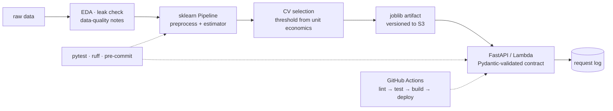

**Data Science @ Technical University of Moldova (2025–2028)** · Chișinău, Moldova

I build ML systems end to end — EDA, model selection, an API someone can actually call, a container, CI, AWS. The three below are small on purpose: every one of them is finished, tested and deployed rather than left at 87% in a notebook. Open to **Data Scientist Intern / Junior Data Scientist / ML Engineer** roles.

[Résumé](https://github.com/Tolreri21/Tolreri21/blob/main/Anatoli_Perederii_CV.pdf) · [LinkedIn](https://linkedin.com/in/anatoli21) · anatoliiperederii21@icloud.com

---

## Three systems, end to end

| Project | The question it answers | The number that matters |
| :--- | :--- | :--- |
| **[LeadGate](https://github.com/Tolreri21/LeadGate)** | Is this bank lead worth a phone call? | PR-AUC `0.417` against a `0.117` base rate — and a threshold priced in euros |
| **[Carpy](https://github.com/Tolreri21/used-car-price-service)** | What is this used car worth, over HTTP? | MAE `$791`, ≈11% of mean price, served from EC2 |
| **[SegmentIQ](https://github.com/Tolreri21/SegmentIQ)** | Which customers are actually paying for the business? | 16% of customers → 64% of revenue |

---

### LeadGate · *is this lead worth a call?*

`scikit-learn` `imbalanced-learn` `AWS Lambda + S3 + ECR` `Docker` `pytest` `GitHub Actions`

- **The feature I had to delete.** Call duration predicts the outcome beautifully and is unknowable at call time. Dropping it cost a lot of apparent performance and bought a model that works in production; it never entered the API contract.
- **The cheaper model won on purpose.** Tuned gradient boosting and logistic regression finished in a statistical tie, so the 7.7 KB logistic model shipped — its odds ratios are something a sales manager can push back on.
- **0.5 is a default, not a decision.** At €100 per sale and €10 per call, the profit-maximising cutoff sits elsewhere. Recall `0.69` on test is the consequence of that arithmetic, not a target I chased.
- **Runs as** a Lambda that pulls its artifact from S3, behind 9 tests and a three-stage pipeline.

**[Code](https://github.com/Tolreri21/LeadGate)** · **[Why these choices](https://github.com/Tolreri21/LeadGate#decisions)**

### Carpy · *a price estimate you can `curl`*

`scikit-learn` `FastAPI` `Pydantic` `PostgreSQL` `Docker Compose` `AWS EC2` `GitHub Actions`

- **One Pipeline, not two code paths.** Preprocessing and estimator are packed into a single joblib artifact, so the transform that trained the model is the transform that serves it. Train/serve skew is a class of bug worth deleting rather than debugging.
- **Selection by cross-validated RMSE**, not by whichever split flattered me: RandomForest over Ridge and plain linear regression on 10,000 listings — test MAE `$791`.
- **Every request is logged to Postgres**, which is where drift monitoring starts. API and database run under Docker Compose on EC2; CI lints, tests and deploys on merge to `main`.

**[Code](https://github.com/Tolreri21/used-car-price-service)** · **[API contract](https://github.com/Tolreri21/used-car-price-service#api)**

### SegmentIQ · *where the revenue actually lives*

`pandas` `scikit-learn` `K-Means` `matplotlib` `pytest` `ruff`

- **541,909 transactions, none of them clean.** Returns, cancellations, missing customer IDs — the write-up documents what I discarded and why, because that is the part of an analysis someone else has to trust.
- **k chosen twice.** Elbow and silhouette agreed on four segments; I still checked them against a quantile-based RFM baseline before believing the clusters.
- **The finding.** A 16% "Champions" segment drives 64% of revenue while a 37% dormant block contributes 7% — each segment named, profiled, and given one retention action.
- **Shipped as an installable package** with tests, ruff and pre-commit, not a notebook that only runs if you execute the cells in the right order.

**[Code](https://github.com/Tolreri21/SegmentIQ)** · **[Findings](https://github.com/Tolreri21/SegmentIQ#results)**

---

## How I build

The same skeleton underneath all three, so the interesting differences are in the modelling, not in the plumbing:

<b>The standards I hold myself to</b>

 

- **One command to reproduce.** Clone, one command, same numbers. If a result cannot be reproduced it is an anecdote.
- **Tests assert the contract**, not just the happy path — schema, ranges, and the features the API is allowed to see.
- **`ruff` + `pre-commit` on every repo**, so a review is a conversation about logic instead of formatting.
- **The README opens with the decision**, not the algorithm. A reader should know why the model exists before they know what it is.
- **Known limitations are written down.** Every one of these projects has a section describing what it does not handle yet.

---

## Now

- **Building** — a fourth project outside tabular land: text, so the sklearn habits get tested against a different failure mode.
- **Learning** — MLflow for experiment tracking beyond a spreadsheet, and enough SageMaker to know when Lambda stops being the right answer.
- **Grinding** — 100+ SQL and 100+ Python problems solved; currently working through window functions until they stop being a lookup.

Updated July 2026

---

## Toolbox

**Modelling** `pandas` `NumPy` `scikit-learn` `PyTorch` `imbalanced-learn` `SciPy`
**Serving** `FastAPI` `Pydantic` `Docker` `Docker Compose`
**Cloud & CI** `AWS` (Lambda, S3, ECR, EC2, IAM, SageMaker) `GitHub Actions` `MLflow`
**Data** `SQL` (PostgreSQL, MySQL, SQL Server) `MongoDB` `PySpark` `Power BI`
**Craft** `pytest` `ruff` `pre-commit` `uv` `Git` `Linux`

Certified: Associate Data Scientist in Python (DataCamp) · AI Engineer for Data Scientists (DataCamp) · SQL Advanced (HackerRank) · Claude Code in Action (Anthropic) — 3rd place, DEVJAM 2026

---

Russian (native) · English (B2) · Romanian (upper-intermediate) — happy to talk about any of the decisions above, including the ones that turned out wrong.
